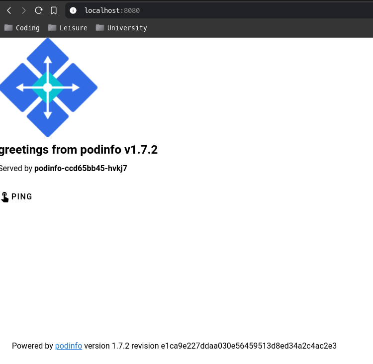

# Exercise 5.3 - Flagger example

```bash
3nd3r1@mypc$ linkerd install --crds | kubectl apply -f -
3nd3r1@mypc$ linkerd install | kubectl apply -f -
3nd3r1@mypc$ linkerd viz install | kubectl apply -f -
3nd3r1@mypc$ kubectl apply -k github.com/fluxcd/flagger/kustomize/linkerd
3nd3r1@mypc$ kubectl create ns test
3nd3r1@mypc$ kubectl apply -f https://run.linkerd.io/flagger.yml
3nd3r1@mypc$ kubectl -n test port-forward svc/frontend 8080
3nd3r1@mypc$ kubectl apply -n test -f canary.yaml
3nd3r1@mypc$ kubectl -n test set image deployment/podinfo podinfod=quay.io/stefanprodan/podinfo:1.7.1
3nd3r1@mypc$ kubectl -n test get ev --watch
3nd3r1@mypc$ kubectl -n test set image deployment/podinfo podinfod=quay.io/stefanprodan/podinfo:1.7.2
3nd3r1@mypc$ kubectl -n test get ev --watch
```

Content of canary.yaml:

```yaml
apiVersion: flagger.app/v1beta1
kind: Canary
metadata:
  name: podinfo
  namespace: test
spec:
  targetRef:
    apiVersion: apps/v1
    kind: Deployment
    name: podinfo
  service:
    # service port number
    port: 9898
    # container port number or name (optional)
    targetPort: 9898
    # Reference to the Service that the generated HTTPRoute would attach to.
    gatewayRefs:
      - name: podinfo
        namespace: test
        group: core
        kind: Service
        port: 9898
  analysis:
    interval: 10s
    threshold: 5
    stepWeight: 10
    maxWeight: 100
    metrics:
    - name: success-rate
      templateRef:
        name: success-rate
        namespace: test
      thresholdRange:
        min: 99
      interval: 1m
---
apiVersion: flagger.app/v1beta1
kind: MetricTemplate
metadata:
  name: success-rate
  namespace: test
spec:
  provider:
    type: prometheus
    address: http://prometheus.linkerd-viz:9090
  query: |
    sum(
      rate(
        response_total{
          namespace="{{ namespace }}",
          deployment=~"{{ target }}",
          classification!="failure",
          direction="inbound"
        }[{{ interval }}]
      )
    ) 
    / 
    sum(
      rate(
        response_total{
          namespace="{{ namespace }}",
          deployment=~"{{ target }}",
          direction="inbound"
        }[{{ interval }}]
      )
    ) 
    * 100
```

Picture:


