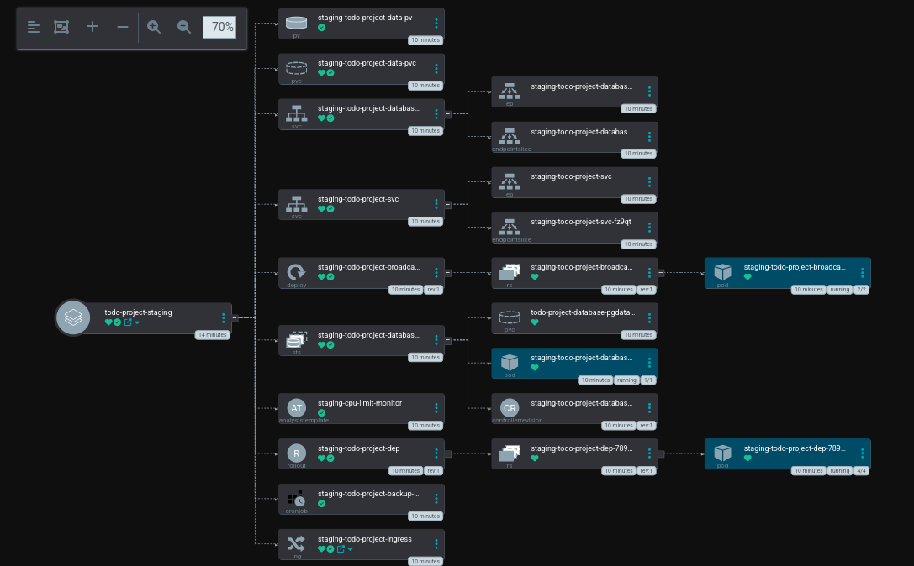

# Todo Project

Todo project, as the name suggests, is a simple todo list application.
However, the deployment itself is far from simple. I have used almost all the Kubernetes features I know to deploy this application.

Here is a overview of the staging deployment:



## How to deploy

Deploying the application in production mode requires my GCP encryption key. However, deploying the application in staging does not.

You need [Linkerd](https://linkerd.io/2.17/getting-started/#step-1-install-the-cli) and [Helm](https://helm.sh) to deploy the application.

### Staging

Run

```bash
make deploy-staging
```

### Development

Development means no Kubernetes cluster, but a Docker container

Run

```bash
docker compose up
```

## View service mesh

The project is using a service mesh called Linkerd

You can view that by running:

```bash
linkerd viz dashboard &
```

## View ArgoCD dashboard

The project is using ArgoCD for continuous deployment

You can view the dashboard by running:

```bash
make argocd-dashboard
```

## How to uninstall

To uninstall the application, run

```bash
make uninstall
```
